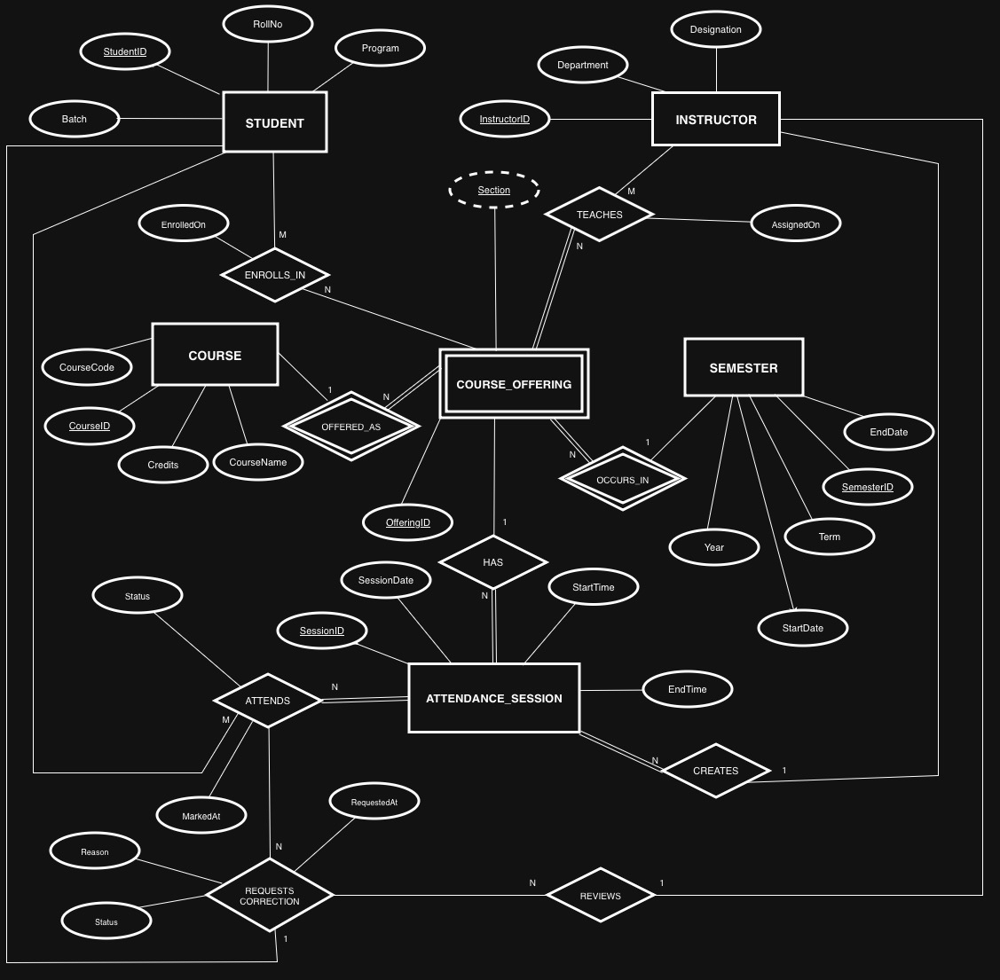
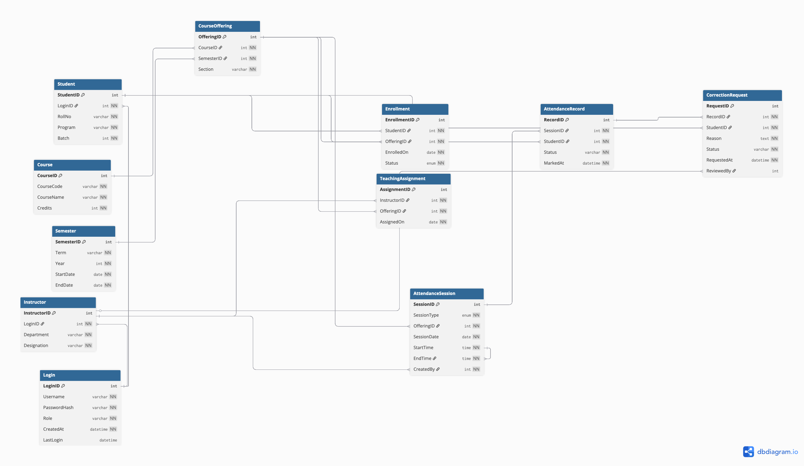

# Multi-Course Attendance Management Portal

## Project Overview

A centralized database-driven system for managing attendance across multiple courses, semesters, and instructors within an academic institution. The system addresses challenges of manual attendance tracking by providing a structured, normalized relational database with enforced integrity constraints.

## Database Statistics

- **Total Tables:** 12
- **Total Entities:** 6 (5 strong entities + 1 weak entity)
- **Total Relationships:** 9
- **Sample Data:** 10-20 rows per table with realistic academic data

## Entity-Relationship Diagram

*Complete ER diagram showing entities, relationships, attributes, cardinality ratios, and participation constraints.*

---

## Relational Database Schema

*Relational schema showing all tables with primary keys, foreign keys, and relationships.*

---

## Core Functionalities

1. **User Authentication and Authorization** - Role-based access control (Student, Instructor, Admin)
2. **Course Management** - Course catalog, semester-wise offerings, multiple sections
3. **Enrollment and Teaching Assignment** - Student enrollments and instructor assignments
4. **Attendance Tracking** - Session-based attendance marking with timestamps
5. **Attendance Correction Workflow** - Student requests and instructor review system

## Database Schema

### Strong Entities
- **STUDENT** - Student information (StudentID, RollNo, Program, Batch)
- **INSTRUCTOR** - Faculty information (InstructorID, Department, Designation)
- **COURSE** - Course catalog (CourseID, CourseCode, CourseName, Credits)
- **SEMESTER** - Academic terms (SemesterID, Term, Year, StartDate, EndDate)
- **ATTENDANCE_SESSION** - Individual class meetings (SessionID, SessionDate, StartTime, EndTime)

### Weak Entity
- **COURSE_OFFERING** - Course instances per semester/section (OfferingID, Section)

### Relationships
1. OFFERED_AS (COURSE → COURSE_OFFERING) - 1:M identifying
2. OCCURS_IN (SEMESTER → COURSE_OFFERING) - 1:M identifying
3. ENROLLS_IN (STUDENT ↔ COURSE_OFFERING) - M:N
4. TEACHES (INSTRUCTOR ↔ COURSE_OFFERING) - M:N
5. HAS (COURSE_OFFERING → ATTENDANCE_SESSION) - 1:M
6. CREATES (INSTRUCTOR → ATTENDANCE_SESSION) - 1:M
7. ATTENDS (STUDENT ↔ ATTENDANCE_SESSION) - M:N
8. REQUESTS_CORRECTION (STUDENT → ATTENDS) - N:1
9. REVIEWS (INSTRUCTOR → REQUESTS_CORRECTION) - 1:M

## Constraints Implemented

- Primary Keys on all tables
- Foreign Keys with referential integrity (CASCADE/RESTRICT)
- NOT NULL constraints
- UNIQUE constraints (RollNo, CourseCode, Username)
- CHECK constraints (Status validation, date/time logic)
- Logical constraints (EndTime > StartTime, session dates within semester bounds)

