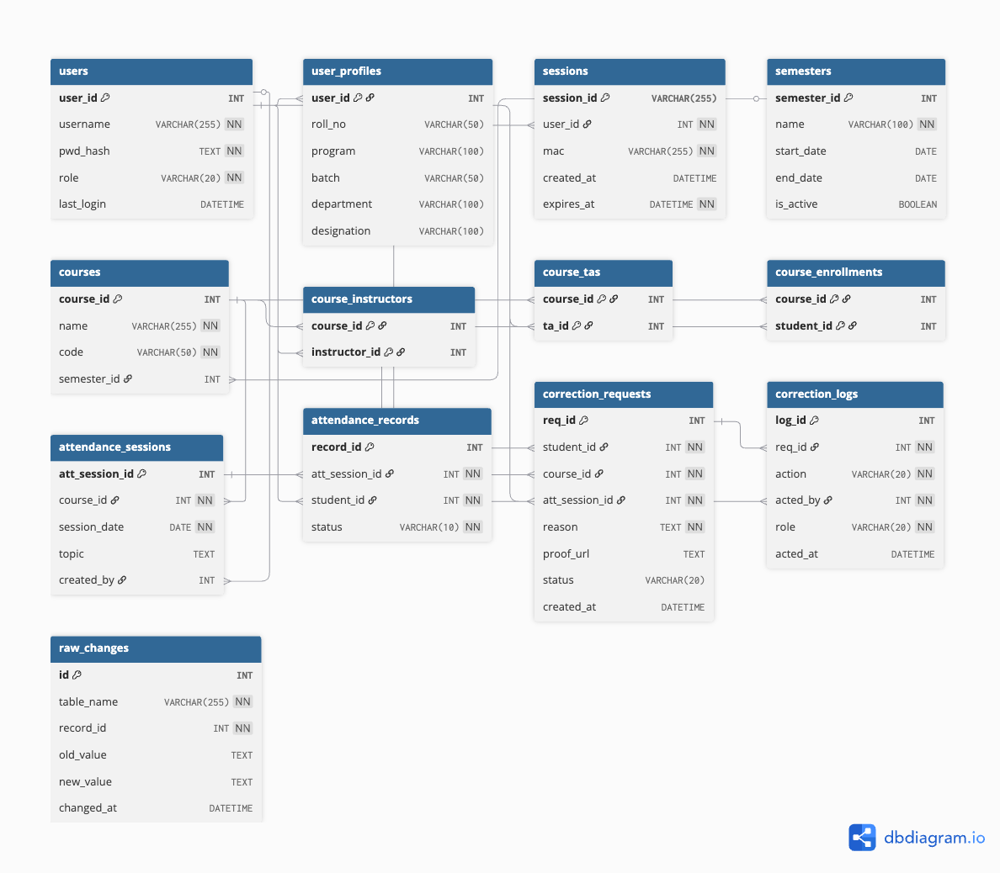

# Multi-Course Attendance Management Portal

## Project Overview

A centralized database-driven system for managing attendance across multiple courses, semesters, and instructors within an academic institution. The system addresses challenges of manual attendance tracking by providing a structured, normalized relational database with enforced integrity constraints.

## Quick Start

### Automated Setup (Recommended)

#### For Mac/Linux Users:
```bash
# Clone the repository
git clone https://github.com/zainabkapadia52/Multi-Course-Attendance-Management-Portal.git
cd Multi-Course-Attendance-Management-Portal

# Run setup script (creates venv, installs dependencies, initializes database)
./setup.sh

# Start the application
./start.sh
```

#### For Windows Users:
```cmd
# Clone the repository
git clone https://github.com/zainabkapadia52/Multi-Course-Attendance-Management-Portal.git
cd Multi-Course-Attendance-Management-Portal

# Run setup script (creates venv, installs dependencies, initializes database)
setup.bat

# Start the application
start.bat
```

### Manual Setup

If you prefer manual setup:

```bash
# 1. Create virtual environment
python3 -m venv venv

# 2. Activate virtual environment
# On Mac/Linux:
source venv/bin/activate
# On Windows:
venv\Scripts\activate.bat

# 3. Install dependencies
cd Module-B
pip install -r requirements.txt

# 4. Initialize database
python init_db.py

# 5. Run the application
python run.py
```

## Project Structure

```
Multi-Course-Attendance-Management-Portal/
├── Module-A/                         # Lightweight DBMS with B+ Tree Indexing
│   ├── database/
│   │   ├── __init__.py               # Package exports
│   │   ├── bplustree.py              # B+ tree implementation
│   │   ├── bruteforce.py             # Brute-force baseline for benchmarking
│   │   ├── db_manager.py             # Database manager abstraction
│   │   ├── table.py                  # Table abstraction layer
│   │   └── performance.py            # Performance benchmarking framework
│   ├── demo_images/                  # Tree visualization outputs
│   ├── report/
│   │   └── report.tex                # LaTeX report
│   ├── report.ipynb                  # Jupyter notebook with benchmarks
│   ├── run_demo.py                   # Demo script
│   └── requirements.txt              # Python dependencies
│
├── Module-B/                         # Attendance Management Web Application
│   ├── app/
│   │   ├── __init__.py               # Flask app factory
│   │   ├── auth.py                   # Authentication logic
│   │   ├── db.py                     # Database connection
│   │   ├── middleware.py             # RBAC middleware
│   │   ├── logger.py                 # Audit logging
│   │   ├── events.py                 # Event broadcasting
│   │   ├── routes/
│   │   │   ├── auth_routes.py        # /login, /isAuth, /logout
│   │   │   ├── admin.py              # /api/admin/*
│   │   │   ├── student.py            # /api/student/*
│   │   │   ├── instructor.py         # /api/instructor/*
│   │   │   ├── dean.py               # /api/dean/*
│   │   │   ├── ta.py                 # /api/ta/*
│   │   │   ├── page_routes.py        # HTML page rendering (UI)
│   │   │   └── stream.py             # Server-sent events
│   │   └── templates/                # HTML templates (frontend)
│   ├── sql/
│   │   ├── schema.sql                # Database schema with indexes
│   │   └── seed.sql                  # Sample data
│   ├── logs/
│   │   ├── audit.log                 # Security audit log
│   │   └── database_logs.log         # Database query logs
│   ├── init_db.py                    # Database initialization
│   ├── run.py                        # Application entry point
│   ├── test_api.py                   # API testing script
│   ├── benchmark.py                  # Performance benchmarking
│   ├── verify.py                     # Verification script
│   ├── create_indexes.sql            # Index creation for optimization
│   ├── module_b_report.tex           # LaTeX report
│   ├── README.md                     # Module-specific documentation
│   └── requirements.txt              # Python dependencies
│
├── images/                           # Schema diagrams
├── setup.sh / setup.bat              # Automated setup scripts
├── start.sh / start.bat              # Application start scripts
└── README.md                         # This file
```

### Access the Application

Once started, open your browser and visit: **http://localhost:5050**

**Default Credentials:**
- **Admin:** `admin` / `password123`
- **Dean:** `dean_joshi` / `password123`
- **Instructor:** `prof_singh` / `password123`
- **TA:** `ta_amit` / `password123`
- **Student:** `aarav_verma0` / `password123`

## Database Statistics

- **Total Tables:** 12
- **Total Entities:** 6 (5 strong entities + 1 weak entity)
- **Total Relationships:** 9
- **Sample Data:** 10-20 rows per table with realistic academic data

## Relational Database Schema



*Relational schema showing all tables with primary keys, foreign keys, and relationships.*

---

## Core Functionalities

1. **User Authentication and Authorization** - Role-based access control (Student, Instructor, Admin)
2. **Course Management** - Course catalog, semester-wise offerings, multiple sections
3. **Enrollment and Teaching Assignment** - Student enrollments and instructor assignments
4. **Attendance Tracking** - Session-based attendance marking with timestamps
5. **Attendance Correction Workflow** - Student requests and instructor review system

## Database Schema

### Strong Entities
- **STUDENT** - Student information (StudentID, RollNo, Program, Batch)
- **INSTRUCTOR** - Faculty information (InstructorID, Department, Designation)
- **COURSE** - Course catalog (CourseID, CourseCode, CourseName, Credits)
- **SEMESTER** - Academic terms (SemesterID, Term, Year, StartDate, EndDate)
- **ATTENDANCE_SESSION** - Individual class meetings (SessionID, SessionDate, StartTime, EndTime)
- **CORRECTION_REQUEST** - Attendance correction request made by the student

### Weak Entity
- **COURSE_OFFERING** - Course instances per semester/section (OfferingID, Section)

### Relationships
1. OFFERED_AS (COURSE → COURSE_OFFERING) - 1:M identifying
2. OCCURS_IN (SEMESTER → COURSE_OFFERING) - 1:M identifying
3. ENROLLS_IN (STUDENT ↔ COURSE_OFFERING) - M:N
4. TEACHES (INSTRUCTOR ↔ COURSE_OFFERING) - M:N
5. HAS (COURSE_OFFERING → ATTENDANCE_SESSION) - 1:M
6. CREATES (INSTRUCTOR → ATTENDANCE_SESSION) - 1:M
7. ATTENDS (STUDENT ↔ ATTENDANCE_SESSION) - M:N
8. REVIEWS (INSTRUCTOR → REQUESTS_CORRECTION) - 1:M

## Constraints Implemented

- Primary Keys on all tables
- Foreign Keys with referential integrity (CASCADE/RESTRICT)
- NOT NULL constraints
- UNIQUE constraints (RollNo, CourseCode, Username)
- CHECK constraints (Status validation, date/time logic)
- Logical constraints (EndTime > StartTime, session dates within semester bounds)
